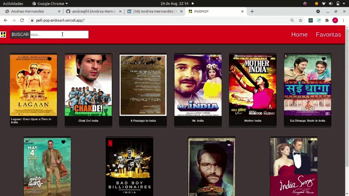
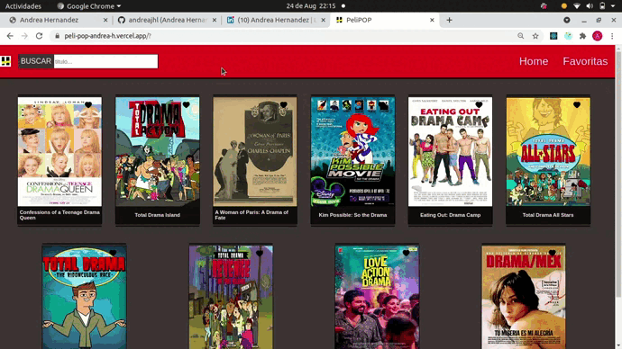
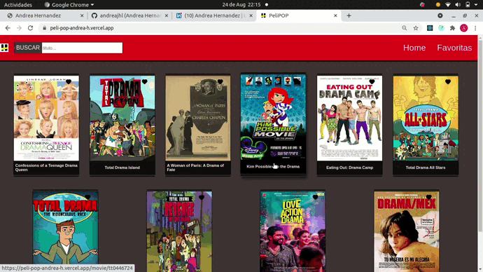

# # APP WEATHER

 Esta aplicacion esta realizada usando la API de IMDB ,  se hace uso de React / Redux, en ella podes buscar peliculas por nombres, esto te traera una variedad de peliculas que contentan la palabra o el titulo completo que buscas, si quieres ver mas detalles como el ranking o un breve resumen solo debes de dar click sobre el nombre y te redirigira a sus detalles, tambien podes agregarlas a favoritos 
 
 

### CLONAR REPOSITORIO

* #### $ git clone https://github.com/andreajhl/peliPOP.git
 
 

### PROBAR

### Después de clonar este repositorio.

* Ingresar a la carpeta del proyecto desde tu editor de codigo favorito.
* Abre la consola del proyecto
* En la terminal del proyecto ejecute la línea de comando, 'npm install'
* Al culminar la instalacion ejecute 'npm start' para arrancar el proyecto.
 
 

### TECNOLOGIAS USADAS

* #### HTML5
* #### SASS
* #### Javascript
* #### ReactJS
* #### Redux
 
 

### PANTALLAS DEL PROYECTO Y USOS

* ### Home
 

 Aca aparece la barra de busqueda, la pestaña de favoritos, y las tarjetas de las peliculas que vayas buscando; Esto lo podes hacer desde el input de busqueda como se muestra en el ejemplo
 

 
 

 En caso de que quieras guardarla en favoritos para no perderla debes clickear el corazon, podes eliminarla cuando quieras
 

 
 

* ### Detalles de cada tarjeta
 

 Al dar clikc en la tarjeta te saldran detalles adicionales de la pelicula, como rango, genero, año y un breve resumen
 

 
 

* ### Seguir buscando
 

Por ultimo, podes buscar nuevas peliculas sin perder las que ya tenes guardadas en favoritos
